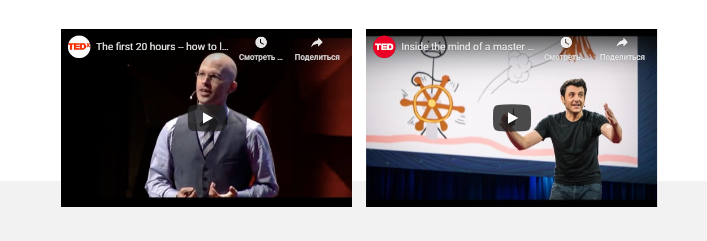

<<<<<<< HEAD
# Научится учиться
В проекте описываются проблемы с изучением того или иного материала и способы научиться изучать материал, 
с помощью некоторых техник приведенных в проекте

## Практики Барбары Оакли
## Метод Фейнмана
## Принципы от Джоша Кауфмана
## Новаторство Салмана Хана

Проект написан на языках HTML и CSS с использованием технологии БЭМ

Особенности проекта 
- Использовали внедрение видео зшс 
- Применили анимацию и получили магический Синий квадрат. Если долго на него смотреть то мальчик
начинает учится лучше!

Планируемые действия
Изучить JS
=======
# how-to-learn
How to learn
>>>>>>> a940de583dcb7ced4145105a2192cc29454794f9
